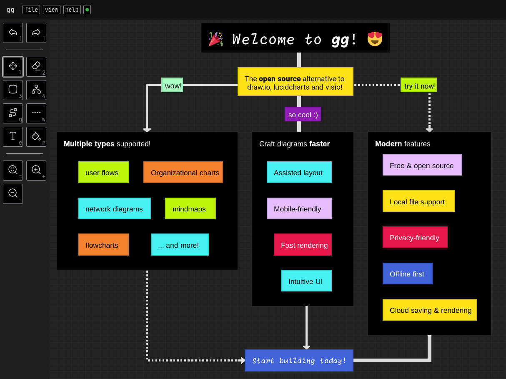

# `gg`

`gg` is a **diagramming editor** for flowcharts, organizational diagrams, mind maps, process diagrams, network diagrams, database diagrams and more! It helps you produce complex diagrams easily, with its simple UI and its innovative approach to layout.

<p align="center">
  <b>Visit <a href="https://gg-charts.com">https://gg-charts.com</a> to start building!</b>
</p>

<p align="center">
  
</p>

## Features

<table>
  <tr>
    <td>
       Free & open-source
    </td>
    <td>
       Mobile-friendly
    </td>
    <td>
       Privacy-friendly
    </td>
    <td>
       Offline first
    </td>
  </tr>
  <tr>
    <td>
       Local file support
    </td>
    <td>
       Assisted layout
    </td>
    <td>
       Fast UI and rendering
    </td>
    <td>
       Presentation mode
    </td>
  </tr>
  <tr>
    <td>
       Multi select
    </td>
    <td>
       Export to PNG
    </td>
    <td>
       Dark mode
    </td>
    <td>
       Infinite canvas
    </td>
  </tr>
  <tr>
    <td>
       Undo / Redo
    </td>
    <td>
       Copy / Paste
    </td>
    <td>
       ...and more!
    </td>
    <td>
    </td>
  </tr>
</table>

## Usage

### Embed in a `iframe`

You can embed `gg` as follow:

```html
<iframe
  width="640"
  height="480"
  src="https://gg-charts.com/viewer.html#file=eJy1VMFymzAQvfsrNJw9DJAyafsRvXSml6YHAQuoFpKK5Bqc8b9XgA1CkVXSNBdAu1q9x759et4hFEgBOSlJjhXh7Bu0Ur+CzyiIwyiMgv2wRRFFYYh9gROSvVTQTInpW+rUd71E6Hl86gQphu3pWZ3TcecYFFwSNZ1+26ijnV4+pPsl0OtAel1e5uKZA0JVFeyMpAX6KH/zA9mC+iG2UOPoPmzRM9yQHFUtFrV8emKKI+gExYSFYegjhOsTU5v4fLT4JB4+AreYUqCaCXSQH4cjpY/GT5yc638Sw0ejAoV6fmyRAtxoLpwhVQOSuAEkcAU6lPXoKAmr/tKmKMkiSrcQTD7ZBB89ugEI2g/Yc86eWpOMQagtTmkX7M2Ek9PMK96vYwO1yAhdVmfNDBloOoVu1I3XvOty/foxU69JAV9n+iWmEjwt/RW1x3xTR20n+CTPeSModKik/DQYgZeowApftd1d6QaUsIPjZsCOiyEzfOv8HewydraY65VFk7KvLJqaeb/Isnm2eO5+jSXQppr1WG6rsbyfLRpYoo2avhRND5zw+OUAfdlqxw/zvprxsuXNS73HlOK26AZ7H0LsRLAkMyCMCXknBGOc3gnBmL2NCIkTYT1vBoAxQG8CcNyZ/xdg7bI3ATw4AdZWMQAMv4wAt7t5cdDu8gfU5QSv">
</iframe>
```
## Development

1. Clone this repository.
2. Run:

```sh
npm install
npm run dev
```
