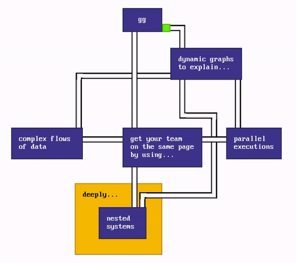

# `gg`

> [!IMPORTANT]
> This tool is still in alpha so expect rough edges. 😅

`gg` is a **diagramming tool** (i.e. flowcharts) and a light **software architecture simulator** for documentation and presentation purposes.

As a diagramming tool, it helps you produce complex diagrams easily, with its simple UI and its innovative approach to layout.

As a software architecture simulator, it helps you define any kind of software architecture and produce step-by-step presentations of various usage scenarios.

<p align="center">
Visit **https://gg-charts.com** to start building!



([play me](https://gg-charts.com/viewer.html#autoplay=true&file=eJy1VMFymzAQvfsrNJw9DJAyafsRvXSml6YHAQuoFpKK5Bqc8b9XgA1CkVXSNBdAu1q9x759et4hFEgBOSlJjhXh7Bu0Ur+CzyiIwyiMgv2wRRFFYYh9gROSvVTQTInpW+rUd71E6Hl86gQphu3pWZ3TcecYFFwSNZ1+26ijnV4+pPsl0OtAel1e5uKZA0JVFeyMpAX6KH/zA9mC+iG2UOPoPmzRM9yQHFUtFrV8emKKI+gExYSFYegjhOsTU5v4fLT4JB4+AreYUqCaCXSQH4cjpY/GT5yc638Sw0ejAoV6fmyRAtxoLpwhVQOSuAEkcAU6lPXoKAmr/tKmKMkiSrcQTD7ZBB89ugEI2g/Yc86eWpOMQagtTmkX7M2Ek9PMK96vYwO1yAhdVmfNDBloOoVu1I3XvOty/foxU69JAV9n+iWmEjwt/RW1x3xTR20n+CTPeSModKik/DQYgZeowApftd1d6QaUsIPjZsCOiyEzfOv8HewydraY65VFk7KvLJqaeb/Isnm2eO5+jSXQppr1WG6rsbyfLRpYoo2avhRND5zw+OUAfdlqxw/zvprxsuXNS73HlOK26AZ7H0LsRLAkMyCMCXknBGOc3gnBmL2NCIkTYT1vBoAxQG8CcNyZ/xdg7bI3ATw4AdZWMQAMv4wAt7t5cdDu8gfU5QSv))
([edit me](https://gg-charts.com/#autoplay=true&file=eJy1VMFymzAQvfsrNJw9DJAyafsRvXSml6YHAQuoFpKK5Bqc8b9XgA1CkVXSNBdAu1q9x759et4hFEgBOSlJjhXh7Bu0Ur+CzyiIwyiMgv2wRRFFYYh9gROSvVTQTInpW+rUd71E6Hl86gQphu3pWZ3TcecYFFwSNZ1+26ijnV4+pPsl0OtAel1e5uKZA0JVFeyMpAX6KH/zA9mC+iG2UOPoPmzRM9yQHFUtFrV8emKKI+gExYSFYegjhOsTU5v4fLT4JB4+AreYUqCaCXSQH4cjpY/GT5yc638Sw0ejAoV6fmyRAtxoLpwhVQOSuAEkcAU6lPXoKAmr/tKmKMkiSrcQTD7ZBB89ugEI2g/Yc86eWpOMQagtTmkX7M2Ek9PMK96vYwO1yAhdVmfNDBloOoVu1I3XvOty/foxU69JAV9n+iWmEjwt/RW1x3xTR20n+CTPeSModKik/DQYgZeowApftd1d6QaUsIPjZsCOiyEzfOv8HewydraY65VFk7KvLJqaeb/Isnm2eO5+jSXQppr1WG6rsbyfLRpYoo2avhRND5zw+OUAfdlqxw/zvprxsuXNS73HlOK26AZ7H0LsRLAkMyCMCXknBGOc3gnBmL2NCIkTYT1vBoAxQG8CcNyZ/xdg7bI3ATw4AdZWMQAMv4wAt7t5cdDu8gfU5QSv))
</p>

## Features

- **Mobile-friendly**: create diagrams with your phone!
- **Privacy-friendly**: no ads, no analytics, no cookies. Built for the small web.
- **Assisted layout**: this tool helps you layout boxes and paths on the canvas.
- **Fast UI and rendering**: it aims to run on a potato.
- **Presentation mode**: show your beautiful work to an external audience.

## Examples

- Diagrams
  - [Systems and sub-systems](https://gg-charts.com/#=&file=eJy9ldFugjAUhu99iq7XxAAzuu0hll0sS5bpRYWjNGDBtg6d4d3XVsUCBd3NCAF6zt/y/afQHkcIYVFARFc0IpLm7AO4UDf8gnAw9sc+9rREUpmBjr1CicRBSNicEqdnoVJfqonQ0VxVgsZanm7ZmhilCRa5oPI0+kWoonvVDELvGjioQBie21Xdu4Z4T6hA6iQXlJEl7BCsyfc9BOGkRRA830NQEA5M2jUxynZdbDKLTvJJscOenXAS1pS+14xpUN8KVY2xHLxRQrO4UTfT7fy0GKjkLJY/PL1rMh/bkzlQyj/XbB0wtv+HmjVf4YJrA1qQdDvzp9hrJ3tB+2CdwB3oAfBBeJcBy0QiVvtZZ7TbRmozgatvjyGnqRvGTHrInD7cfLVJ/2nKS+fIRnTTqFH1zFyd7zOsD6dp08v6fYGD/n9ZjjK6oXI+Z0leohigqFdBFYsIQ0tADFQ7fsDOcStHdNGJtVVNhZ29ZlqLiLouzB6RUZY6dgjSXQDxsjsjeEPjOIM3IiVwsy8VtADcXUg+8x3SBYg4EAnIvFXVZAmyBGDo8plc4UbVL+f8bkE=)
  - [Colors](https://gg-charts.com/#=&file=eJzFlMtSgzAUhvd9ihi3DAO9YHGpe8eF48ZxEeCkzXAJJam9Td/dpCAFGmqrM9oFJeec5Hz8+ZPdACEscggZZSGRjGevUAj1h+8Rdm3HdrClSySTCejYE6yQ2AgJaZko34VKvakhQrvDUyVYpMvn3nSRxofSQzTngsly+a9KFV2roetYx8BGBYajaryvZ9cUtm2jCChZJhKFPOGFsPGgUduh8Oc8n10CMe0w+P0IL3MuQHEcl+1K0QRpwCTrYCyx1UwYgWoox2rHNJjTCO1ba7U0Cnma8wwyKZBGrev21dv7GdGGC+qtLxFtOPkD1bZbvkn+R7VWYUDCeFbwZRY9at/pKbfjkTeKpgZ16480zaIUXNc/Z9tJnMnhRTtwd+XZCZdC8rQ6Ojf4LOfU0b+Kc1B9FU5YFhtOPTl1OA5MF0HKoiiBZyIlFIfLJmc5YDPtnHzA0b9drcipPcqWHfl+1LGdfjDIE4TUc8KuPDThK4M8yur5GavHsKEFSaFrX0wLnvbcHZI35D1a0Pq2g2vs0NmnRouy9+87tLel0cBwxCMiiUl08Fx/HFwFYxbU0LOEMVD2wfiuC8G493LVnhjsPwGnIqNB)
  - [Labels on links](https://gg-charts.com/#=&file=eJylkj1PwzAQhvf8ipNZS5W0pUKMsCMmFsrgOBdi6thR7H6r/52LA6UyaQllceL78PP6Pe8iAGYrFDKXgjtp9DPWlj7sDlgyjIcxGzQlTjqFTewRV2A31mHZJtp/S6kX2gLs/EoJmTXl65v1Ft99qY9WxkrXHv9VSdE1bZNk8B3YUGAUf+73h+6DChYdJUKkKFH3IY4nATEZX0ZMl/k860OcjMI7Ti8jrrZFkfQhjm4D4njyK5HWVz9bJfW8Y7K8a7Bph/WlzDKFT9w5rP2DqmSF7CfXc0BwDQVfIiieorLd1z/NDizpzfYw4LK04AykOJtpgZq6MAOjwRUkiPSdkROQ044n8Uc1ZAXJ8GYIo0xtg9J7LuZvtVno7KFJN51XqcinsTgjM5D0r4F5mY1TNDNvWblQTl6TUXj0iKL9B2wvDCA=)
  - [Various link styles and directions](https://gg-charts.com/#=&file=eJzNl8FyqjAUhvc+BcNaOyAy0u76Anfu6m7aLqJEjcSAJBWx47s3kBYTSNUUmMsGyUn8+Tw5/J58jCzLpglcohVaAoZi8g+mlH/YT5btPjgPjj0uljDEMCxif2Bm0ZwyuBMT4p7yqRc+tKyP8sonUFgs91m0Wpcry2ASU8SE+vdCHj3y4cT1x5dIziPTr+G5+nYFkaAEXkTrCDKGhEI3j0Fgj+UJLU6F5IzVWAHlSKGzolXB2SPNAg3Pce8jZsLjTvsF2q0Qzk2APA3P/DbPs1Xsn4WoBXAGcvr6ShZoEqIULotnASwBf929jSS9WokFGfPze0osuL/AaIy5uGmFHd4Pro8HVGJon5Hj2qjGZv0Sedt0Q9tmyO8yQygyMgVtgjoEmh9W6bFtgtwOdwzDEzazKV2GuiQCAfC91inqcM9y5syS9q+ZIdId1gj2JEH3WKMnWfktbwxjxqC5Oa69ebgYkDcG5JTiaEjeuIsp3gzIG2dBRIx2rG9v3MzW2+mQvPFAEH4flDfS7TY+DckbszhaPv5fa+TXt/KsghGJNCcV0Dwd2Itmh27vUBhi+Bdw+0tJdQzR2i/QtINCs9aSNUXL1nPCUa9Jq2YqlGuG1lQWxn1LWn3JhLRa59eVL/8LDKRMWkRieRaSsPGjQZrG2RU0tZYEmlrwv0STH9+KULVwQajaaH+EZX5/RlM77+9ilLvfq7XYI5na8goytev8HVn7glM7TUFWa/Z6S1qTsPCx0fkTLu+yiw==)
- Simulator
  - [The architecture of this app](https://gg-charts.com/viewer.html#file=eJzVmkGX2jYQgO/7K/R8plsMLAs5ddMc+vqaNu8lr5eSg7EFaDG2Y8kLbN7+98qSMbY0MpbxdtM9JCB75G80oxnNmO83CDk0wT5ZEd9jJI7+xinl/znvkOPeDm+HziC/hREW4nzsT7xH9EgZ3skL8jPll/7hXxH6Lv7lF0iQ3/7Nf5pm4k4xmMSUMDn76UY+euBff5pOBueRYz4yKb6/lOIlxfs03lOcnidWMaooFZzNdMYnGFQvgEgl1t2gPpaDjdzK2EttshLwl/X6Zz9OlWdBlCpplXab3FFnoF40EpfU7lQVKtCHyvCLNnmpQRh7AV/hm4bbDdgT338MNl24h9djP3khCTwWdyJ37w5zb9snueu2R48TnIotCNjc5DmQMhWFkt1kGWizXdapSa9SN9UqoHp1FfHhHfKC4LMMINqtL8rI1w423N1v0rRPE07bW5CSXRYCzlf5dlapMg8QqeJ7dxnbRKrxGAhVVRM1RCockBz6mlhFWbocd4pVrmHdR3dvunVi95Dps11W6qzY/27r4LW7OXax4biHfLNhuxDhJxwxtPGiIOTHkN5sGe6ft8vHa4w56t+YcfRrSPzt65hyPWSPz6tOtuwjlVHmMdyb+eaP0yf9PHFZn1Int2fz+VmackddLCIWxyFgQV28Qb3n4Wyb/UBJ+qydH0crss5kaH0dR53O8Nzv4qeje1PeGLX300/kQH7/3Jujbh9H48lrWdKd2ZuS8QCjHuINYg1qLdeb7fqq/Tdv0ku1Vwu9uH/y4uR6zfxRMDlco9ms57zQnP/EzU2+mf/BtOeS4Js3I3AuFHdd1Fvc1eCs4rpJ//wPXAMhpeTHTzGJGE4/xHsg+IiZgNGv4KJtSIA/lwu38kKKr3SdQzRLomtcB4hf4prYEx18h/o4wi2CtBbsLq1Nu0A+TpLsuc+6a2RReNUSFU9cWRLwA0inHsBqHkSjTj0AUyEztlAEDmxdCkg2Zcu9TQE5Vw7xgn1SGTIUkL99+fgH+vDXx6vKR3w/fwYOjP9Jy2iZMaYeb1r2izKc9OrzFiWv70VPHm3lJ8Wncucbd3zxOKWHS/YkPZzP3w1N3EklHQp9TkcWoIWb0ZOX53yCzQlJtAVayR5QwznLs9uA7GYhWU6YhZQMKYVkO8AsVO/VSpmiEWoWUle2lU4g3iWdwCdJ9zUL1d1byhRPNwvV+yZSSOYGs0w9d0gZWRXZycjzt52MbJHayUhj28nIvqRZpn7Ibmeger0hZeQ8dmxFzjMLKUlRSskTkFmofkLS6cptvwrjPbDteXxKGt7obPFxlXo7rIZTZ5XGO8DnxTUWw9nGCTD1U5IUcc35ssEoj1DIz3s0lB9GEeNDC+chCIr3XwsHqZnDlJErqC6ICgBJUqBzBaHKuoFQlOQFX4CyBC2PgrioJawYRyAjhCIh9f4MxFiQIIoZ5QtZ9jL5OnpUsFIcYp9x/HpXpQXx2NIB9MTdwgG8COFdwo6IJp6PEZEuoebhFrQTkBZgkrBAxWbnA7LL0ckVYFTA4G+PegeiQkSSVW/wq6jvPcrhiq1fdMWEbw4AVu4IYUiLKFF17vLdhJU2U1AbgFkqo1df0LqXKHzHcZ9mMZKFklQQbvZ1ZtXbmj8C6z3ICiAVDq29QIVYazgFZ4q8JAkJli7RzQlmsEvrTG0X9gFFeK/g8m0YL5lHIhxYwc3tVlL/MQO0kiCe+CmCHZwLHwkACEkH/GahNV7xkwNbQvgkAIG0XcAHiaITpphlKbfv7e2tHSN8EjCu4mUH5AT5Vtb2MNI6Nm3w4LRvdEH9pwHw/lg4aRYxssM8emtryaORraXhJArQ2G3jRsyTye1I4RxqXFCgVwaeo04BUQRyPnDqcuWuEBCahJ7M/rlWhU5XhHgXzkcQrFRDb+VCWhTpXrRZ8xWWWlkusGX60V8oQWQLZ82n52EyTrgryHc+nQnhnAMskSTU3w01rF1pdw6XH5f6YQMW6Q3Y4HQIINhUICqbtCjtWnjY7u9KD0Y8ofgkW4uifr95+Rc41+vI).
  - [How Redux works](https://gg-charts.com/viewer.html#file=eJzFl8tymzAUhvd5Cg1rJwM4zqW7TvaZTtPpppMFFgLkACKSHNvN5N0rAcEgjjDGSepFgoQu3y/p/By9niHkiIJgGlEcSMry34QL9c/5hhzvwr1wnZluIqlMia67JxskdkKSrHpRPQv16o8qIvRa/lUvaKibyxdvEZcty8qCCSqr0d8bqtqtKp7Pvdm+ZqdqFnXxrendQPwk4XqLfnD2QkPC98ObMG2gFtSlm2HhzNovQLAGzp116zSe26p664y1x2RMojuWFSwnuexOCKGauC3khb+Orp2Z+dKKbUMH8XsSujLuEpqGFh2DWiA9LU0kW+G0N9phXUParPpAjV2d90TJUEIPyC07DUnWP5i6kR5e/X2m4Mhlo4Pyy1Z6CTzbGAPLoH/gUpS9muVYC/JAUoIl4w7Y2DLGAelFEO0+RLn/edI5ybWvwKqB2kfwjCTKnB6acxIFqSC9ZuZoj52ygWrxhqtt6odTvMG/tZjD/P+bA9/k29Up5uDdfKw7LNdSqjn7O9jvNiArdq8v3ZN0fbDpDUb5cdpEcpus4pP2zGJnU8XZ4vhA1LVKncgejOgWCpByxGl4lRyTchihWa6APyLnEGojyUmpxpIIvJhkJ8DuldzeeDvhKrPD5paNs8EbjF/IJO7TsYUMJJkC/Rz7t5toCvUc8LdjsUMqikDipLfg0yKgfqqiqZ7WuA9wn8Xz1ZgLwXxh3Ae8a/uFQLlYLUFDlMhOSvMn4F4S9L8uzrK1FSB8AOxV1auKFnsnw/CrTtVRtXfqhuC4PuBEtSXbe3UT0XEzQX3KrM7exdz25X4TjF2LUrYBdk2duGLgXvdEdhEPMmJmxE7EWQanE45klgB0QrX8nBb1uXS+5yjAuoCoQE3IhPuQsVl/i8oHqaDJK6y+CZtUvxKCardEOEjxOlUWJJBU1bm+o3cdaQTiHEQEQCrCvt1ChA2KXjvMsozKI1fuEsQCZq+w+jerg1hLzoIQB+XlTzKUUvWUEy4+ExPIA7+GcwFyAqtWcfZuaxAlfs/+RQ1F8xhFjJeHscLn5NxMxibDQmtX0QIZ6JfyurD3dM2vxQu4EoCrP24IpxQ/CaRMSEOal5HJDmQ9oK3vWjlB99uu7frs7R+TqCQI) (inspired by [their documentation](https://redux.js.org/tutorials/fundamentals/part-2-concepts-data-flow#redux-application-data-flow))

## Roadmap

The upcoming features of `gg` are available in **[the roadmap to v1](https://github.com/jodigiordano/gg/milestone/1)**.

Do not hesitate to [create an issue](https://github.com/jodigiordano/gg/issues) for feature requests, bugs, etc.

## Usage

> [!IMPORTANT]
> More ways to use `gg` are in the work.

### Embed in a `iframe`

You can embed `gg` as follow:

```html
<iframe
  width="640"
  height="480"
  src="https://gg-charts.com/viewer.html#autoplay=true&file=eJy1VMFymzAQvfsrNJw9DJAyafsRvXSml6YHAQuoFpKK5Bqc8b9XgA1CkVXSNBdAu1q9x759et4hFEgBOSlJjhXh7Bu0Ur+CzyiIwyiMgv2wRRFFYYh9gROSvVTQTInpW+rUd71E6Hl86gQphu3pWZ3TcecYFFwSNZ1+26ijnV4+pPsl0OtAel1e5uKZA0JVFeyMpAX6KH/zA9mC+iG2UOPoPmzRM9yQHFUtFrV8emKKI+gExYSFYegjhOsTU5v4fLT4JB4+AreYUqCaCXSQH4cjpY/GT5yc638Sw0ejAoV6fmyRAtxoLpwhVQOSuAEkcAU6lPXoKAmr/tKmKMkiSrcQTD7ZBB89ugEI2g/Yc86eWpOMQagtTmkX7M2Ek9PMK96vYwO1yAhdVmfNDBloOoVu1I3XvOty/foxU69JAV9n+iWmEjwt/RW1x3xTR20n+CTPeSModKik/DQYgZeowApftd1d6QaUsIPjZsCOiyEzfOv8HewydraY65VFk7KvLJqaeb/Isnm2eO5+jSXQppr1WG6rsbyfLRpYoo2avhRND5zw+OUAfdlqxw/zvprxsuXNS73HlOK26AZ7H0LsRLAkMyCMCXknBGOc3gnBmL2NCIkTYT1vBoAxQG8CcNyZ/xdg7bI3ATw4AdZWMQAMv4wAt7t5cdDu8gfU5QSv">
</iframe>
```

## Contribute

The best way to contribute to this project is to:

- **Spread the word** if you enjoy the app.
- **Create Github issues** when you find bugs or you need a feature.
- **Send me your creations** that I can share publicly in this README.

## Development

1. Clone this repository.
2. Run:

```sh
npm install
npm run dev
```
