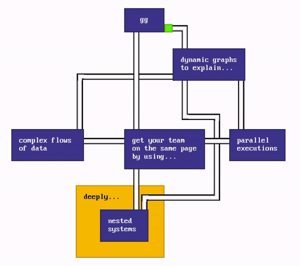
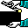
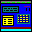
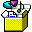

# `gg`

> [!IMPORTANT]
> This editor is still in alpha so expect rough edges. 😅

`gg` is a **diagramming editor** (ex: flowcharts) and a light **software architecture simulator** for documentation and presentation purposes.

As a diagramming editor, it helps you produce complex diagrams easily, with its simple UI and its innovative approach to layout.

As a software architecture simulator, it helps you define any kind of software architecture and produce step-by-step presentations of various usage scenarios.

<p align="center">
  <b>Visit <a href="https://gg-charts.com">https://gg-charts.com</a> to start building!</b>
</p>

<p align="center">
  
</p>

<p align="center">
  (<a href="https://gg-charts.com/viewer.html#id=bf84c3fa-33b2-4407-95ac-e09e8c4eea89&autoplay=true">play me</a>)
  (<a href="https://gg-charts.com/#id=bf84c3fa-33b2-4407-95ac-e09e8c4eea89">edit me</a>)
</p>

## Features

<table>
  <tr>
    <td>
       Free & open-source
    </td>
    <td>
       Mobile-friendly
    </td>
    <td>
       Privacy-friendly
    </td>
    <td>
       Offline first
    </td>
  </tr>
  <tr>
    <td>
       Local file support
    </td>
    <td>
       Assisted layout
    </td>
    <td>
       Fast UI and rendering
    </td>
    <td>
       Presentation mode
    </td>
  </tr>
  <tr>
    <td>
       Data flow simulation
    </td>
    <td>
       Export to PNG
    </td>
    <td>
       Dark mode
    </td>
    <td>
       Infinite canvas
    </td>
  </tr>
  <tr>
    <td>
       Undo / Redo
    </td>
    <td>
       ...and more!
    </td>
    <td>
    </td>
    <td>
    </td>
  </tr>
</table>

## Examples

- Diagrams
  - [Systems and sub-systems](https://gg-charts.com/#id=be6f8310-4023-43bf-b755-41a4fae250a7)
  - [Colors](https://gg-charts.com/#id=bf442e5c-2689-4953-b228-593e4648ccb7&autoplay=true)
  - [Labels on links](https://gg-charts.com/#id=5aba2725-ec43-4107-899f-4cbd05666735)
  - [Various link styles and directions](https://gg-charts.com/#id=cea38700-8656-4b21-872b-af4d4ed7c050)
- Simulator
  - [Data flow & descriptions](https://gg-charts.com/viewer.html#id=1392f86b-6593-4f33-990b-1f39f112d1e7&autoplay=true)
  - [The architecture of this app](https://gg-charts.com/viewer.html#id=1e6f6c63-3e63-4c61-93c2-1edefb8ef97a&autoplay=true).
  - [How Redux works](https://gg-charts.com/viewer.html#id=4f4239d3-b5a5-4357-ab26-b9a048bcf45c&autoplay=true) (inspired by [their documentation](https://redux.js.org/tutorials/fundamentals/part-2-concepts-data-flow#redux-application-data-flow))

## Roadmap

The upcoming features of `gg` are available in **[the roadmap to v1](https://github.com/jodigiordano/gg/milestone/1)**.

Do not hesitate to [create an issue](https://github.com/jodigiordano/gg/issues) for feature requests, bugs, etc.

## Usage

> [!IMPORTANT]
> More ways to use `gg` are in the work.

### Embed in a `iframe`

You can embed `gg` as follow:

```html
<iframe
  width="640"
  height="480"
  src="https://gg-charts.com/viewer.html#autoplay=true&file=eJy1VMFymzAQvfsrNJw9DJAyafsRvXSml6YHAQuoFpKK5Bqc8b9XgA1CkVXSNBdAu1q9x759et4hFEgBOSlJjhXh7Bu0Ur+CzyiIwyiMgv2wRRFFYYh9gROSvVTQTInpW+rUd71E6Hl86gQphu3pWZ3TcecYFFwSNZ1+26ijnV4+pPsl0OtAel1e5uKZA0JVFeyMpAX6KH/zA9mC+iG2UOPoPmzRM9yQHFUtFrV8emKKI+gExYSFYegjhOsTU5v4fLT4JB4+AreYUqCaCXSQH4cjpY/GT5yc638Sw0ejAoV6fmyRAtxoLpwhVQOSuAEkcAU6lPXoKAmr/tKmKMkiSrcQTD7ZBB89ugEI2g/Yc86eWpOMQagtTmkX7M2Ek9PMK96vYwO1yAhdVmfNDBloOoVu1I3XvOty/foxU69JAV9n+iWmEjwt/RW1x3xTR20n+CTPeSModKik/DQYgZeowApftd1d6QaUsIPjZsCOiyEzfOv8HewydraY65VFk7KvLJqaeb/Isnm2eO5+jSXQppr1WG6rsbyfLRpYoo2avhRND5zw+OUAfdlqxw/zvprxsuXNS73HlOK26AZ7H0LsRLAkMyCMCXknBGOc3gnBmL2NCIkTYT1vBoAxQG8CcNyZ/xdg7bI3ATw4AdZWMQAMv4wAt7t5cdDu8gfU5QSv">
</iframe>
```

## Contribute

The best way to contribute to this project is to:

- **Spread the word** if you enjoy the app.
- **Create Github issues** when you find bugs or you need a feature.
- **Send me your creations** that I can share publicly in this README.

## Development

1. Clone this repository.
2. Run:

```sh
npm install
npm run dev
```
